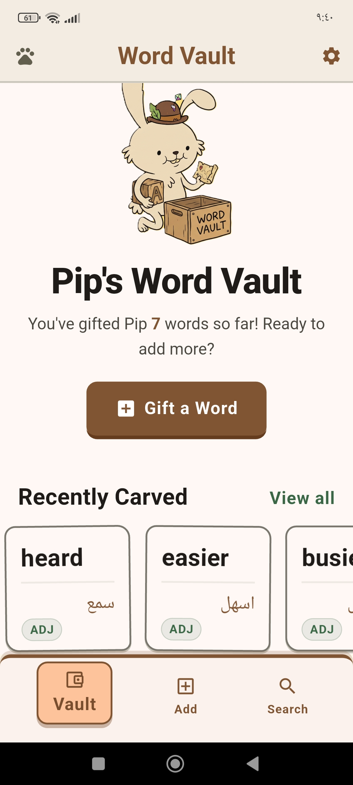
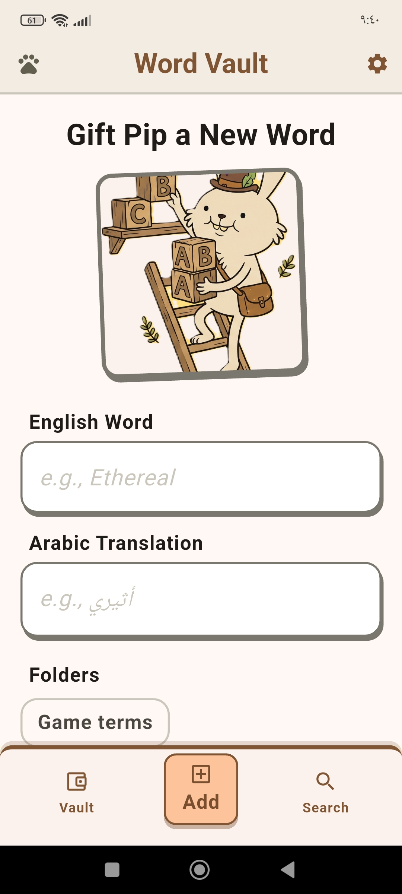
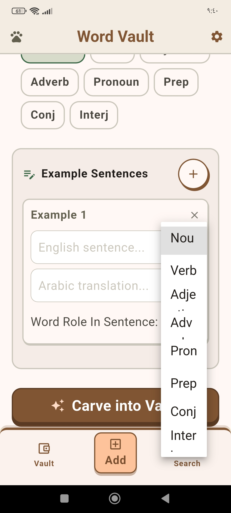
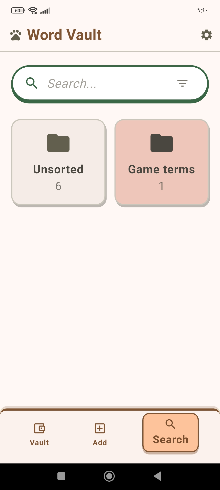
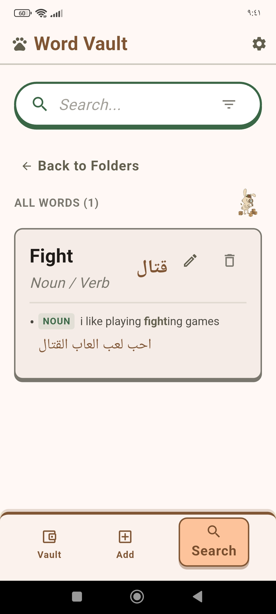

<h1 align="center">
   
  Pip's Word Vault
</h1>

  <strong>A beautiful, minimalist vocabulary builder and dictionary app designed to help you store and master new words.</strong>

  

  <a href="#features">Features</a> •
  <a href="#download--installation">Download</a> •
  <a href="#tech-stack">Tech Stack</a> •
  <a href="#screenshots">Screenshots</a>

---

## 🌟 Features

- **Store Words with Context:** Add words along with their Arabic translation, parts of speech, and multiple example sentences.
- **Smart Organization:** Categorize your vocabulary into custom folders for quick access (e.g., "Travel", "Work", "Daily Use").
- **Search & Filter:** Instantly find any word using the powerful search bar, or filter your vault by parts of speech (Nouns, Verbs, Adjectives, etc.).
- **Minimalist & Beautiful UI:** Enjoy a clean, visually pleasing interface with subtle animations, custom styling, and our mascot, Pip!
- **Offline First:** All your words and folders are securely saved locally on your device. No internet connection required!
- **Bulk Actions:** Easily manage your vocabulary with bulk move and delete functionalities.

## 🚀 Download & Installation

You can download the latest version of Pip's Word Vault directly to your Android device!

1. Go to the [Releases](../../releases) page.
2. Download the latest `app-release.apk` file.
3. Open the downloaded file on your Android device to install the app.
   *(Note: You may need to enable "Install from unknown sources" in your Android settings.)*

## 🛠 Tech Stack

- **Framework:** [Flutter](https://flutter.dev/)
- **Language:** [Dart](https://dart.dev/)
- **Local Storage:** `shared_preferences` for lightweight, on-device data persistence.
- **State Management:** Flutter's native `StatefulWidget` for fast, reactive UI updates.
- **Localization:** Full support for custom localization, preparing the app for multi-language expansion.

## 🎨 Design

Pip's Word Vault utilizes a carefully crafted design system featuring:
- Soft, pastel color palettes.
- Engaging, rounded UI elements (Cards, Buttons, and Navigations).
- Custom typography (`Outfit` and `Inter` via Google Fonts, if configured).
- Adorable empty states and illustrations to keep you motivated!

## 📸 Screenshots

  
  &nbsp;&nbsp;
  
  &nbsp;&nbsp;
  
  &nbsp;&nbsp;
  
  &nbsp;&nbsp;
  

---

  <i>"Master a new word every day, and watch your world expand."</i>

